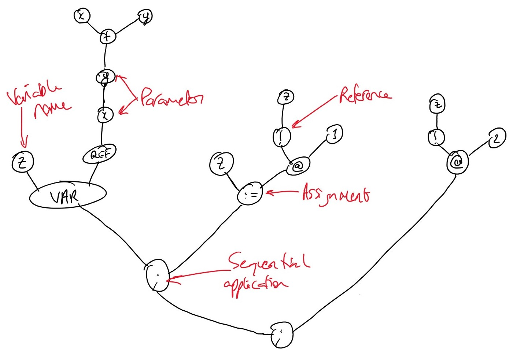

# PLPDI Compilers: Assignment 2

## Question A

```ocaml
func f x = x + x
func twice f x = f(f(x))
twice f 1
```

1. Draw the AST

**Note: Variable (named) root nodes represent parameters**


\pagebreak


\pagebreak

2. Draw the ASG

I created the ASG of this program using the SPARTAN online ASG-based abstraction machine.

The following _SPARTAN_ statement:

>```SPARTAN
>bind f = LAMBDA(;x. PLUS(x,x)) in
>bind twice = LAMBDA(; f. LAMBDA(; x. APP(f,APP(f,x))))
>in
>APP(APP(twice,f),1)
>```

Created the following ASG:

{ height=40% }

3. Perform type inference on this program


\pagebreak
4. Draw the intermediate ASGs in the evaluation of this program

**Note Diagrams read from left to right on the page**


\pagebreak

\pagebreak

\pagebreak

\pagebreak

\pagebreak

\pagebreak

\pagebreak

\pagebreak

\pagebreak

\pagebreak

## Question B

```OCaml
var z = ref(func x y -> x + y)
z := (!z)(1)
(!z)(2)
```

1. Draw the AST of this program


\pagebreak

2. Draw the ASG of this program

This ASG was created using the SPARTAN visualiser with the code:

>```SPARTAN
>new z = LAMBDA(;x. LAMBDA(;y.  PLUS(x,y))) in
>bind a = ASSIGN(z,APP(DEREF(z),1)) in
>bind b = APP(DEREF(z),2) in
>SEC(a;b)
>```


\pagebreak

3. Draw the intermediate ASGs in the evaluation of this program

**Note Diagrams read from left to right on the page**


\pagebreak

\pagebreak

\pagebreak

\pagebreak

\pagebreak

\pagebreak

\pagebreak

\pagebreak

4. Perform type inference on this program


\pagebreak

### Static Vs Dynamic Typing

In statically typed languages, such as C or Rust, one is required to specify the type of any variable, function parameter or return argument explicitly.
In dynamically typed languages, such as Python, a variable or method can be said to have `Any` type. This allows for less verbose, more flexible code. Dynamic typing in and of itself does not lead to runtime errors, instead it makes it much easier for a programmer to accidentally cause them.

For example, in python you could define a function:

```python
f = lambda x,y: x**y
```

And call it with:
```python
f(2,"foo")
```
leading to a runtime error

Whereas, in Rust, a dynamically typed language (that does not attempt to cast explicitly defined variables), The compilation fails as it expects an `i32` not a `str`

```rust
fn main() {

    let f = |x:i32,y:i32| { x^y };

    f(1,2); // Ok
    f(2,"foo"); // Compilation Error

}
```

In the context of this example, we are assuming the type of `+`. If instead the operator had the type `str -> str -> str` the program would fail at runtime as we attempted to pass integers. If the compiler knew the type of `+`, i.e. in our graph `+` was already labelled `str -> str -> str` then our type inference for the rest of the program would fail, leading to a compilation error rather than a runtime error.
